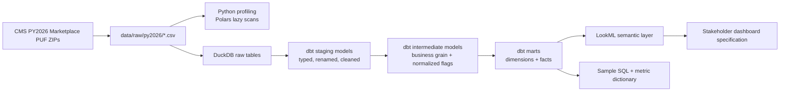

# ACA Marketplace Analytics Engineering

**A healthcare insurance analytics engineering project using real CMS ACA
Marketplace Public Use Files to model premiums, benefits, plan availability, and
geography into tested analytics marts.**

This is a recruiter-ready portfolio project for an Analytics Engineer I role in
health insurance analytics. It demonstrates how raw public healthcare insurance
files can become a documented, tested, BI-ready warehouse using Python, DuckDB,
dbt, SQL, and LookML-style semantic modeling.

## Project pitch

Health insurance teams need reliable answers to market questions: where plans
are offered, how premiums vary, which issuers compete in each county, and how
benefit design differs across metal levels. This project simulates that internal
analytics engineering use case using official CMS Plan Year 2026 ACA Marketplace
Public Use Files.

The result is a reproducible local analytics warehouse with:

- Automated CMS PUF download with manual fallback instructions.
- Raw profiling for row counts, null rates, duplicate checks, key coverage, and
  sample values.
- DuckDB raw tables for local development on multi-million-row CSV files.
- dbt staging, intermediate, and dimensional mart models.
- dbt tests for not-null, uniqueness, accepted values, and relationships.
- LookML semantic layer files for BI exploration.
- Stakeholder-facing docs, dashboard spec, metric dictionary, and sample SQL.

## Real Data Validation Results

Validated against real official CMS PY2026 Marketplace PUF CSVs downloaded from
`https://download.cms.gov/marketplace-puf/2026/`.

| Dataset | Rows validated | Columns |
| --- | ---: | ---: |
| Rate PUF - PY2026 | 2,235,761 | 20 |
| Plan Attributes PUF - PY2026 | 22,059 | 151 |
| Benefits and Cost Sharing PUF - PY2026 | 1,457,952 | 24 |
| Service Area PUF - PY2026 | 8,820 | 14 |

Final real-data dbt build:

```text
PASS=83 WARN=0 ERROR=0 SKIP=0 NO-OP=0 TOTAL=83
```

Raw CSVs, local DuckDB databases, dbt target artifacts, raw profile outputs, and
caches are generated locally and intentionally **not committed**.

## Architecture



## Why this matches Analytics Engineer I

| Requirement | How this project demonstrates it |
| --- | --- |
| SQL | Builds dimensional marts and sample stakeholder queries over premiums, benefits, issuers, geographies, and plan availability. |
| dbt | Uses staged, intermediate, and mart layers with model documentation and 83 passing real-data dbt checks. |
| Semantic modeling / LookML | Defines LookML views and explores for plans, premiums, benefits, and geography with business metrics. |
| Cloud warehouse readiness | Uses DuckDB locally while keeping layered models, source contracts, tests, and BI semantics portable to Snowflake, BigQuery, Redshift, or Databricks with adapter/profile changes. |
| Dimensional modeling | Implements `dim_issuer`, `dim_plan`, `dim_geography`, `dim_metal_level`, `dim_benefit`, `dim_age_band`, `fact_premium`, `fact_plan_availability`, and `fact_benefit_cost_sharing`. |
| Healthcare insurance analytics | Uses real ACA Marketplace public files to analyze premiums, metal levels, plan design, benefits, service areas, and county availability. |
| Stakeholder communication | Includes executive summary, metric dictionary, dashboard spec, real-data validation notes, and sample SQL for analytics/product/actuarial/operations/strategy audiences. |

## Business framing

Health insurance stakeholders need a trusted way to answer market questions:

- Which issuers and plans are available in each county?
- How do premiums vary by rating area, metal level, age band, and tobacco usage?
- How do deductible and out-of-pocket maximums differ by product design?
- Which benefits are commonly covered across plans and issuers?

This warehouse supports:

- **Analytics teams** with reproducible dbt marts and documented SQL metrics.
- **Product teams** with plan design, deductible, and benefit comparisons.
- **Actuarial teams** with premium benchmarks by age, geography, issuer, and
  metal level.
- **Operations teams** with county/service-area availability reporting.
- **Market strategy teams** with issuer competition and county opportunity
  analysis.

## Data source

Real data only. The pipeline is designed for official CMS/Data.HealthCare.gov
Health Insurance Exchange Public Use Files, Plan Year 2026:

1. Rate PUF - PY2026
2. Plan Attributes PUF - PY2026
3. Benefits and Cost Sharing PUF - PY2026
4. Service Area PUF - PY2026

Raw CSV files and DuckDB database files are intentionally ignored by git. See
`docs/real_data_validation_results.md` for raw profiling highlights, mart row
counts, known limitations, and exact reproduction commands.

## Repository structure

```text
.
├── data/
│   ├── raw/py2026/              # Manual fallback location for CMS CSV files
│   └── processed/               # Local DuckDB database and profiling outputs
├── dbt_project/                 # dbt DuckDB project
│   ├── macros/
│   └── models/
│       ├── staging/
│       ├── intermediate/
│       └── marts/
├── docs/                        # Executive summary, metrics, validation, dashboard spec, SQL
├── dashboards/                  # BI dashboard planning artifact
├── lookml/                      # LookML semantic layer
└── scripts/                     # Download, profile, and DuckDB load scripts
```

## Quickstart

### 1. Create a Python environment

```bash
python3 -m venv .venv
source .venv/bin/activate
pip install -r requirements.txt
```

### 2. Download or place raw CMS files

Try automatic discovery and download:

```bash
python3 scripts/download_cms_pufs.py
```

If automatic discovery succeeds, the four CSV files will be saved under
`data/raw/py2026/`.

### 3. Profile raw files

```bash
python3 scripts/profile_raw_data.py
```

Outputs:

- `data/processed/raw_profile_py2026.json`
- `data/processed/raw_profile_py2026.md`

The profile includes row counts, column counts, null rates, duplicate key checks,
and sample values.

### 4. Load raw CSVs into DuckDB

```bash
python3 scripts/load_to_duckdb.py
```

Output database:

```text
data/processed/aca_marketplace_py2026.duckdb
```

### 5. Build and test dbt models

```bash
cd dbt_project
dbt debug --profiles-dir .
dbt build --profiles-dir .
dbt docs generate --profiles-dir .
```

## Manual data download fallback

CMS public dataset links can change. If `scripts/download_cms_pufs.py` cannot
discover a reliable file URL, manually download the Plan Year 2026 Marketplace
PUF CSV files from CMS or Data.HealthCare.gov and place them in:

```text
data/raw/py2026/
```

Rename the files exactly:

```text
rate_puf_py2026.csv
plan_attributes_puf_py2026.csv
benefits_cost_sharing_puf_py2026.csv
service_area_puf_py2026.csv
```

Direct CMS ZIP URLs validated for PY2026:

```text
https://download.cms.gov/marketplace-puf/2026/rate-puf.zip
https://download.cms.gov/marketplace-puf/2026/plan-attributes-puf.zip
https://download.cms.gov/marketplace-puf/2026/benefits-and-cost-sharing-puf.zip
https://download.cms.gov/marketplace-puf/2026/service-area-puf.zip
```

Then continue with:

```bash
python3 scripts/profile_raw_data.py
python3 scripts/load_to_duckdb.py
cd dbt_project && dbt build --profiles-dir .
```

## Pipeline overview

1. **Download:** `scripts/download_cms_pufs.py` searches CMS,
   Data.HealthCare.gov, and catalog.data.gov metadata for Plan Year 2026 CSV/ZIP
   resources. If discovery fails, it prints clear manual fallback instructions.
2. **Profile:** `scripts/profile_raw_data.py` uses Polars lazy CSV scans to
   profile large files, including the Rate PUF.
3. **Load:** `scripts/load_to_duckdb.py` loads the four raw CSVs into a local
   DuckDB database as raw tables.
4. **Transform:** dbt builds layered staging, intermediate, and mart models.
5. **Serve:** LookML and sample SQL expose stakeholder-facing metrics.

## dbt architecture

### Staging

- `stg_rate_puf`
- `stg_plan_attributes_puf`
- `stg_benefits_cost_sharing_puf`
- `stg_service_area_puf`

Staging models standardize names, trim text fields, and cast dates/numeric
values.

### Intermediate

- `int_plan_base`
- `int_rate_enriched`
- `int_benefit_cost_sharing`

Intermediate models define reusable business grain and normalized attributes,
such as age bands and benefit coverage flags.

### Marts

Dimensions:

- `dim_issuer`
- `dim_plan`
- `dim_geography`
- `dim_metal_level`
- `dim_benefit`
- `dim_age_band`

Facts:

- `fact_premium`
- `fact_plan_availability`
- `fact_benefit_cost_sharing`

## Data quality and dbt tests

The dbt project includes:

- `not_null` tests on required keys and facts
- `unique` tests on dimensional surrogate keys and fact primary keys
- `accepted_values` tests for metal levels, geography types, and age bands
- `relationships` tests from facts to dimensions
- Model and column descriptions for dbt docs

## Business metrics

Defined in `docs/metric_dictionary.md`, `docs/sample_queries.sql`, and LookML:

- Average monthly premium
- Median silver premium
- Plan count by county
- Issuer count by county
- Average deductible
- Average out-of-pocket maximum
- Benefit coverage rate
- Premium difference by metal level

## Semantic layer

LookML files in `lookml/`:

- `plans.view.lkml`
- `premiums.view.lkml`
- `benefits.view.lkml`
- `geography.view.lkml`
- `marketplace_analytics.model.lkml`

These files define explores and measures for plan availability, premiums, and
benefit cost sharing.

## Stakeholder deliverables

- `docs/executive_summary.md`
- `docs/metric_dictionary.md`
- `docs/sample_queries.sql`
- `docs/dashboard_spec.md`
- `dashboards/dashboard_specification.md`

## Resume bullets

### Analytics Engineer version

- Built a tested ACA Marketplace analytics warehouse using real CMS PY2026 PUFs,
  DuckDB, dbt, dimensional modeling, and LookML-style semantic models; validated
  3.7M+ raw rows with 83 passing dbt checks.

### Data Analyst version

- Modeled public healthcare insurance data into reusable premium, benefit,
  issuer, metal-level, and county availability metrics with stakeholder-facing
  SQL queries, metric definitions, and dashboard requirements.

### Data Scientist / Analytics version

- Created a reproducible healthcare market intelligence dataset from CMS ACA
  Marketplace files, enabling analysis of premium variation, plan design,
  issuer competition, and geography-level plan availability.

## Notes for cloud warehouse readiness

This project is a local development warehouse, not a deployed production
platform. DuckDB is used for reproducible local validation, while the layered
model design is intentionally portable to Snowflake, BigQuery, Redshift, or
Databricks with adapter-specific profile changes. Raw file ingestion, staged
typing, conformed dimensions, fact grains, dbt tests, docs, and LookML semantics
mirror production analytics engineering patterns without overclaiming production
deployment.
